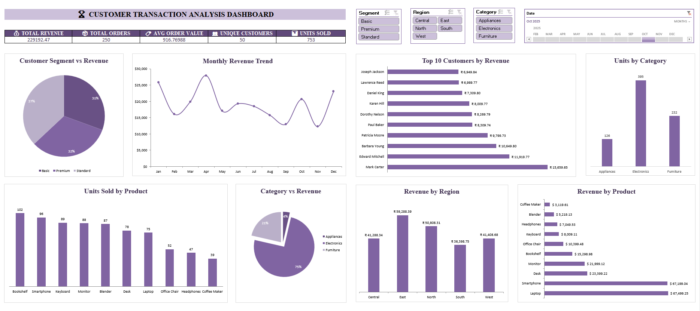

# 📊 Customer Transaction Analysis

<div align="center">


</div>

> **An interactive Excel-based business intelligence dashboard for deep-diving into customer transactions, revenue trends, and product performance.**

---

## 🖼️ Dashboard Preview



---

## 📌 Overview

The **Customer Transaction Analysis Dashboard** is a comprehensive, visually-rich Excel dashboard designed to give businesses a 360° view of their sales and customer data. Built with dynamic filters and interactive charts, it empowers decision-makers to uncover insights at a glance — from top-performing customers to regional revenue distribution.

---

## ✨ Key Features

| Feature | Description |
|---|---|
| 📈 **Monthly Revenue Trend** | Line chart tracking revenue from Apr 2024 to Apr 2025 |
| 🥧 **Customer Segment Analysis** | Pie chart breaking down Basic, Premium & Standard segments |
| 🏆 **Top 10 Customers by Revenue** | Ranked bar chart of highest-value customers |
| 📦 **Units by Category** | Bar chart comparing Appliances, Electronics & Furniture |
| 🛍️ **Units Sold by Product** | Product-level sales volume comparison |
| 🌍 **Revenue by Region** | Regional breakdown across East, North, West, Central & South |
| 💰 **Revenue by Product** | Individual product revenue ranked from lowest to highest |
| 🔵 **Category vs Revenue** | Donut chart showing revenue share by product category |

---

## 🎛️ Interactive Filters / Slicers

The dashboard includes four dynamic slicers for real-time filtering:

- **Segment** — Filter by Basic, Premium, or Standard customers
- **Region** — Drill into Central, East, North, South, or West
- **Category** — Focus on Appliances, Electronics, or Furniture
- **Date** — Slice data by month across 2025

---

## 📊 KPI Summary Cards

| Metric | Value |
|---|---|
| 💵 Total Revenue | $229,192.47 |
| 🛒 Total Orders | 250 |
| 📋 Avg Order Value | $916.77 |
| 👤 Unique Customers | 50 |
| 📦 Units Sold | 753 |

---

## 🗂️ File Structure

```
📁 Project
├── 📊 PR__Final_Project.xlsx    # Main Excel dashboard file
├── 🖼️  Dashboard.png             # Dashboard screenshot/preview
└── 📄 README.md                  # Project documentation
```

---

## 🛠️ Tools & Technologies

- **Microsoft Excel** — Dashboard design, pivot tables & charts
- **Excel Slicers** — Dynamic interactive filtering
- **Pivot Charts** — Auto-updating visualizations
- **Conditional Formatting** — Visual data emphasis
- **Data Modeling** — Structured transaction dataset

---

## 🚀 How to Use

1. **Download** the `PR__Final_Project.xlsx` file
2. **Open** it in Microsoft Excel (2016 or later recommended)
3. **Enable Macros/Content** if prompted
4. **Use the slicers** (Segment, Region, Category, Date) to filter the dashboard
5. **Explore** charts and KPIs that update dynamically based on your selection

---

## 📁 Data Dimensions

The underlying dataset captures the following dimensions:

- Customer Name & Segment (Basic / Premium / Standard)
- Product Name & Category (Appliances / Electronics / Furniture)
- Region (East / North / West / Central / South)
- Order Date, Quantity, Unit Price & Total Revenue

---

## 📬 Connect

Feel free to reach out for collaborations, feedback, or questions about this project!

---

## 💫 A Note to Close

> *"Data is not just numbers — it's a story waiting to be told. Every chart, every trend, every insight is a chapter of a bigger narrative that drives smarter decisions."*

This dashboard is a reflection of the belief that **great analysis is not about complexity — it's about clarity**. Every visual here was crafted with the intent to make data speak simply, boldly, and meaningfully.

To every analyst, student, and data enthusiast reading this — keep building, keep questioning, and keep turning raw data into real wisdom. **The world needs more people who can find the signal in the noise.** 🚀

---

## 👤 Author

<div align="center">

<table>
  <tr>
    <td align="center" style="padding: 20px;">
      <br/>
      <b>✦ RENSEE GAJIPARA ✦</b><br/><br/>
      
      <br/><br/>
      
      
      <br/><br/>
      <i>"Transforming raw data into meaningful insights, one chart at a time."</i><br/>
    </td>
  </tr>
</table>

</div>

---

<div align="center">

⭐ *If you found this project helpful or inspiring, consider giving it a star!* ⭐

**Made with 💜 and a lot of pivot tables by RENSEE GAJIPARA**

</div>
